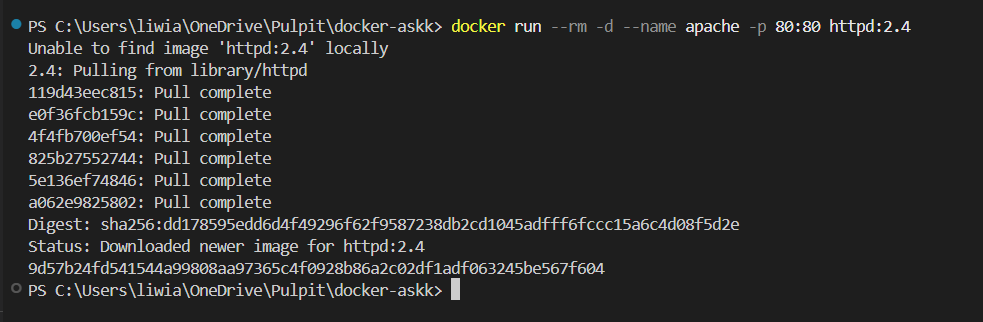
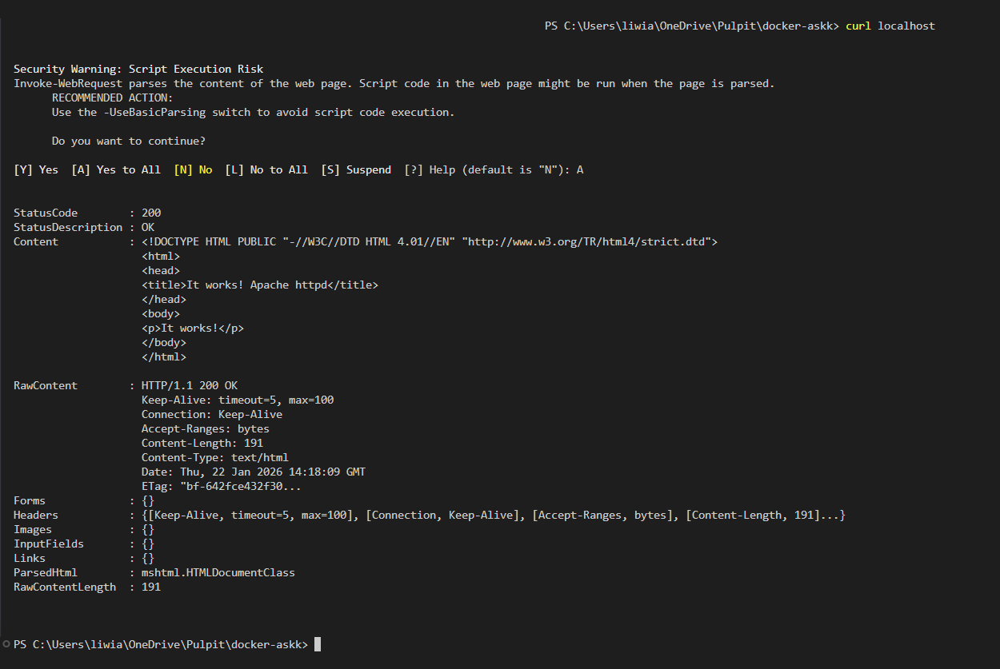
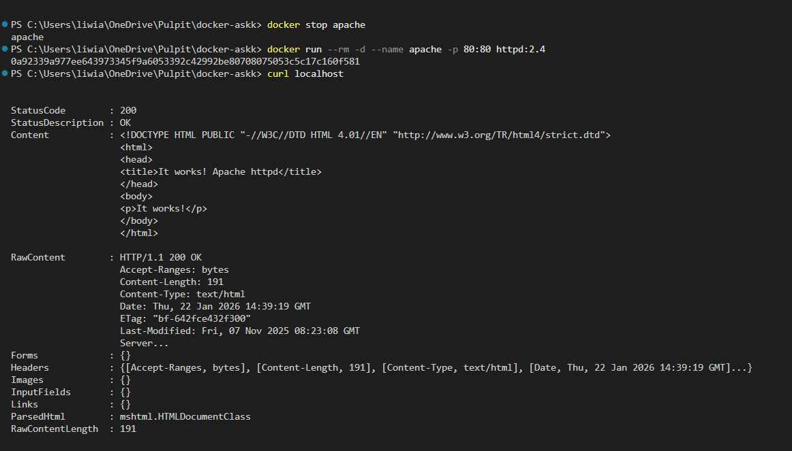
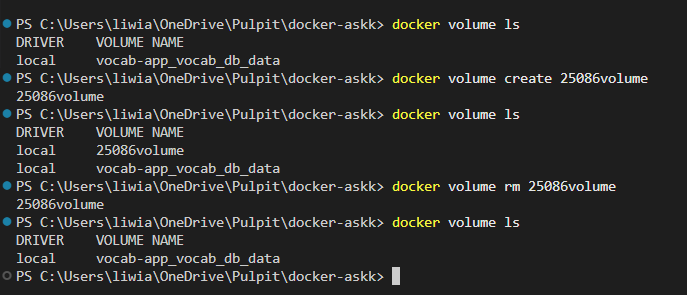
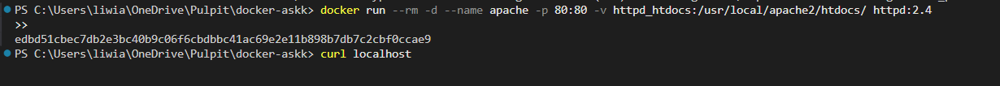
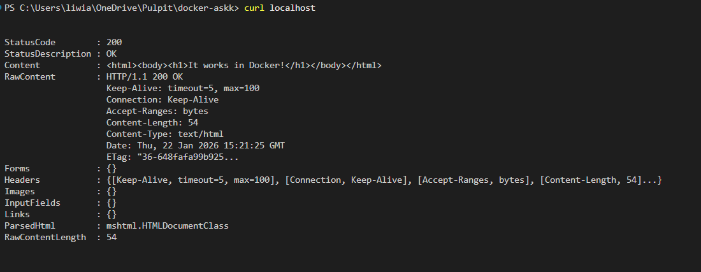
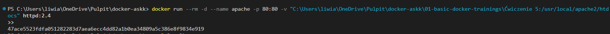
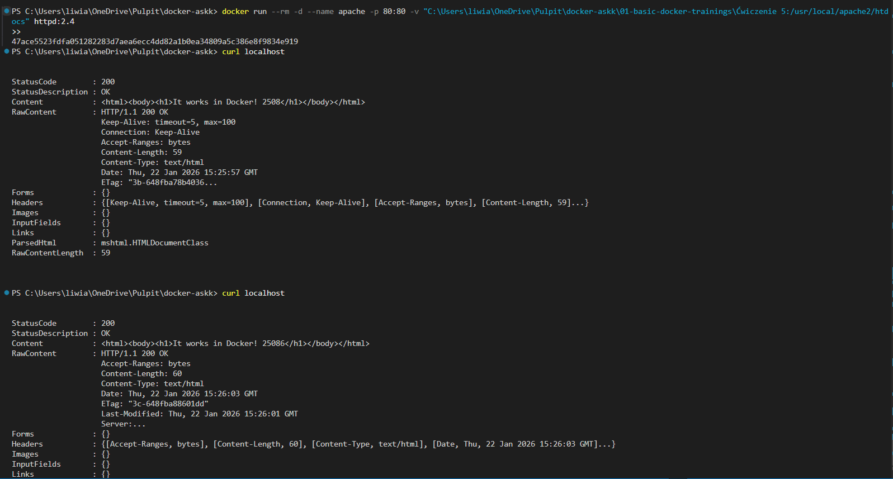

# Basic docker trainging

## Ćwiczenie 5: Wolumeny

### Uruchamianie serwera

> `docker run --rm -d --name apache -p 80:80 httpd:2.4`

> `curl localhost`

> `docker cp ".\01-basic-docker-trainings\Ćwiczenie 5\index.html" apache:/usr/local/apache2/htdocs/`

> `docker stop apache`

> `docker run --rm -d --name apache -p 80:80 httpd:2.4`

> `curl localhost`

### Zarządzanie wolumenami

> `docker volume ls`

> `docker volume create 25086volume`

> `docker volume ls`

> `docker volume rm 25086volume`

> `docker volume ls`

### Montowanie wolumenów w kontenerach

> `docker volume create httpd_htdocs`

> `docker run --rm -d --name apache -p 80:80 -v httpd_htdocs:/usr/local/apache2/htdocs/ httpd:2.4`

> `curl localhost`

> `docker run --rm -d --name apache -p 80:80 -v "C:\Users\liwia\OneDrive\Pulpit\docker-askk\01-basic-docker-trainings\Ćwiczenie 5:/usr/local/apache2/htdocs" httpd:2.4`

*Można zauważyć, że po zamontowaniu katalogu z hosta zmiany w pliku HTML są widoczne w kontenerze od razu, bez konieczności ponownego kopiowania pliku za pomocą polecenia docker cp.*

