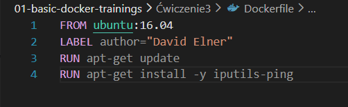
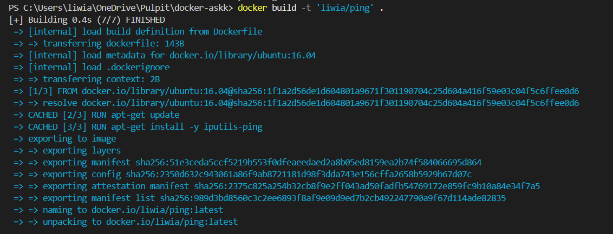
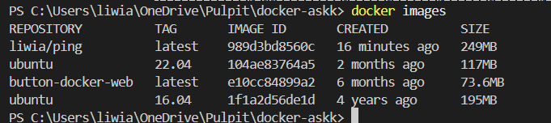
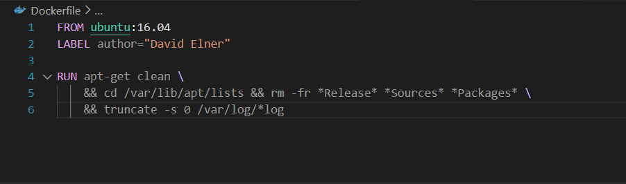
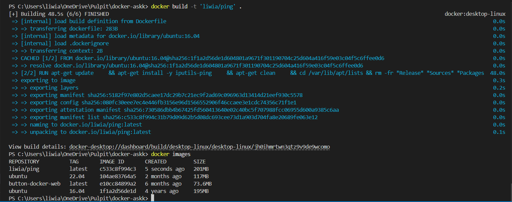
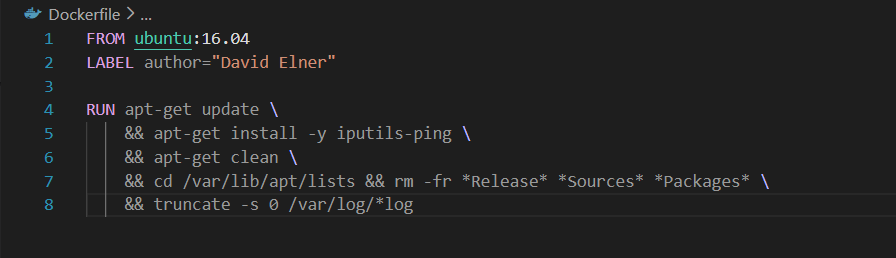
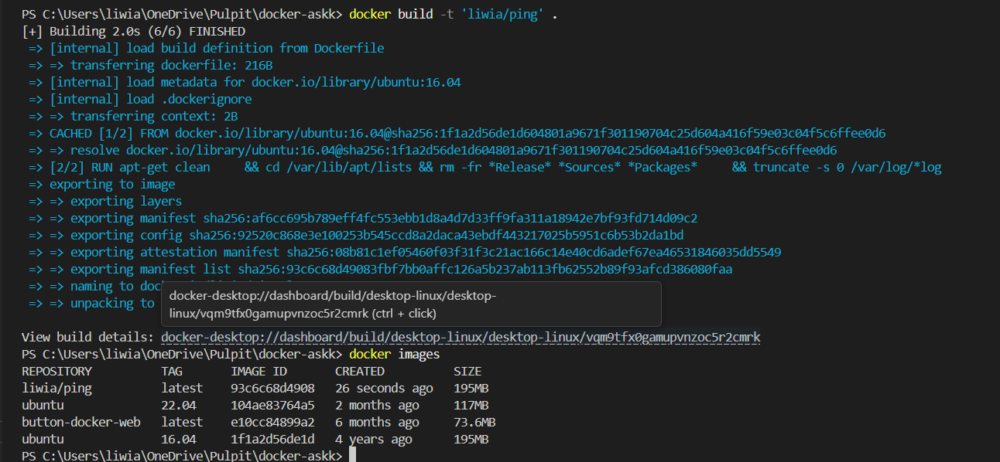

# Basic docker trainging

## Ćwiczenie 3: Budowanie obrazów

### Usunięcie obrazów i kontenera

>New-Item Dockerfile

>docker build -t 'liwia/ping' .

>docker images

### Optymalizacja Dockerfile

### Poprawa o 48 MB

>docker build -t 'liwia/ping' .
>docker images

#### Poprawa o 6 MB

