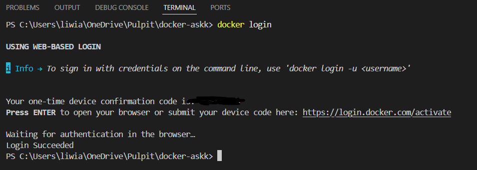
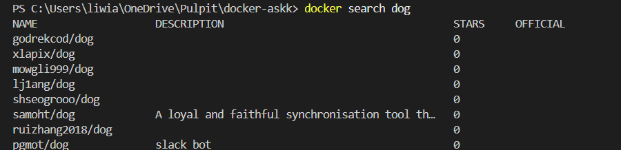
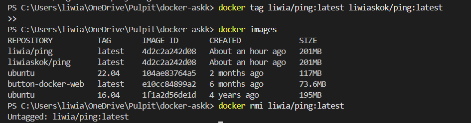
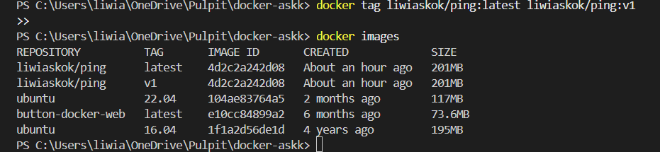
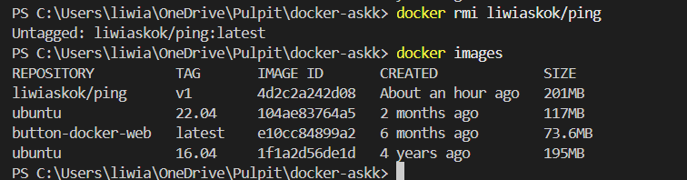
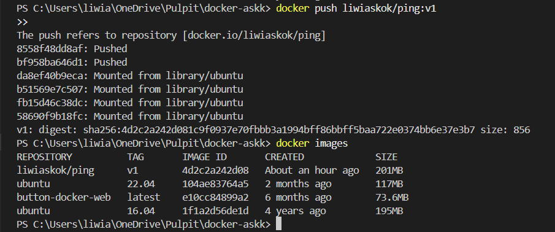

# Basic docker trainging

## Ćwiczenie 4: Udostępnianie obrazów

> `docker login`

> `docker search dog`

### Zmiana nazwy

> `docker tag liwia/ping:latest liwiaskok/ping:latest`

> `docker images`

> `docker rmi liwia/ping:latest`

> `docker tag liwiaskok/ping:latest liwiaskok/ping:v1`
> `docker images`

> `docker rmi liwiaskok/ping`
> `docker images`

> `docker push liwiaskok/ping:v1`
> `docker images`

[Dockerhub](https://hub.docker.com/r/liwiaskok/ping)