# Basic docker trainging

## Ćwiczenie 6: Sieci

### Listowanie sieci

> `docker network ls`

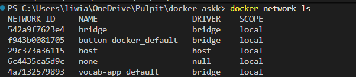

> `docker network inspect bridge`

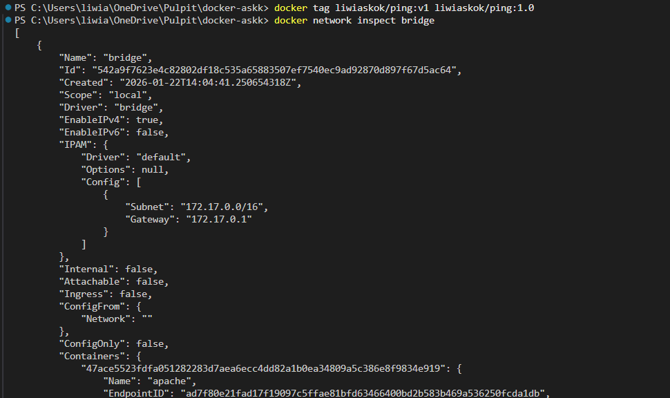

> `docker run -d --name pinger liwiaskok/ping:1.0 ping 172.17.0.2`

> `docker logs pinger`

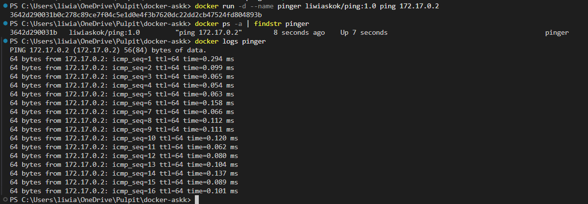

> `docker network create skynet`

> `docker network ls`

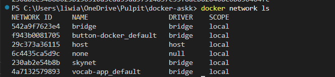

> `docker network inspect skynet`

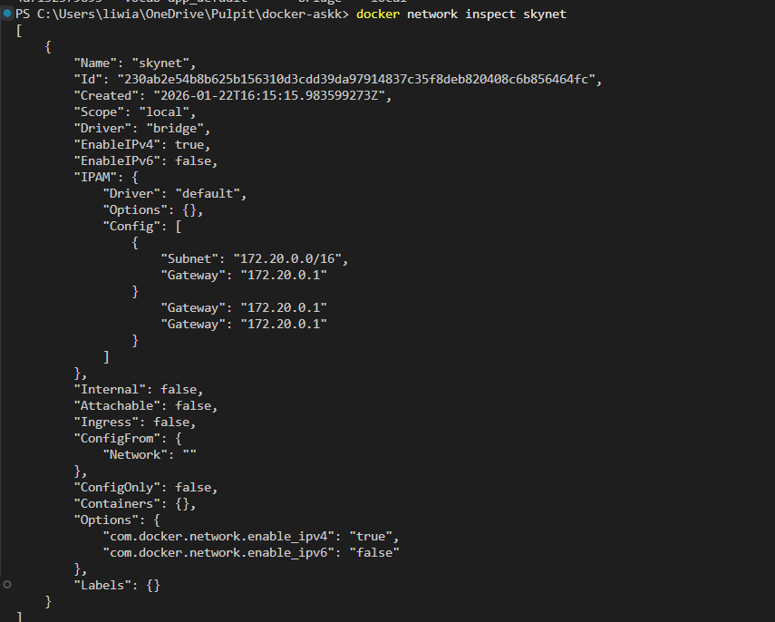

> `docker run --rm -d --network skynet --name dummy liwiaskok/ping:1.0`

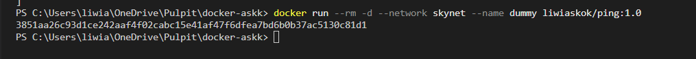

> `docker run --rm -d --network skynet -e PING_TARGET=dummy --name pinger liwiaskok/ping:1.0`

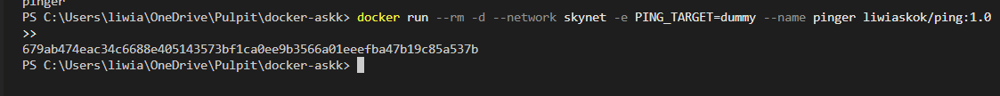

> `docker logs pinger`

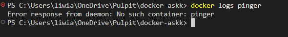

### Połączenia między kontenerami w sieci

> `docker run --rm -d --name widgetdb --network skynet -e POSTGRES_PASSWORD=secret -p 5432 postgres`

> `docker ps`

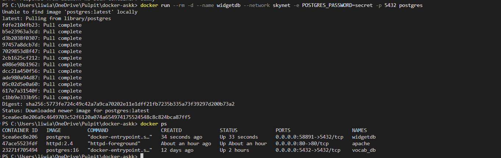

> `docker run --rm -d --name gadgetdb --network skynet -e POSTGRES_PASSWORD=secret -p 5432 postgres`

> `docker ps`

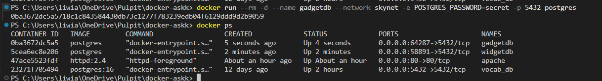

> `docker exec -it widgetdb /bin/bash`

*psql -U postgres*
*\q*

*psql -U postgres -h gadgetdb*
*\q*

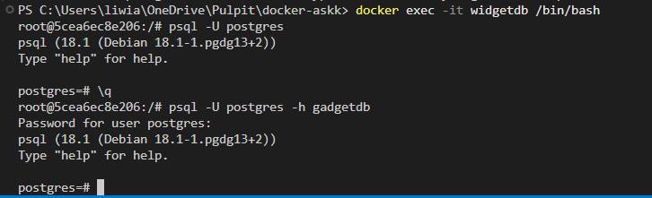

