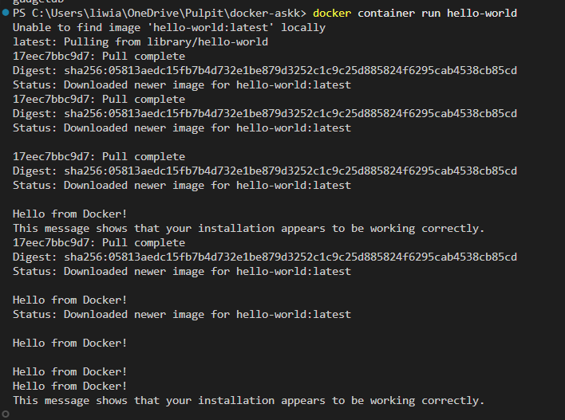
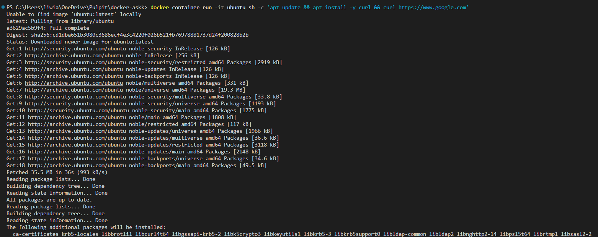
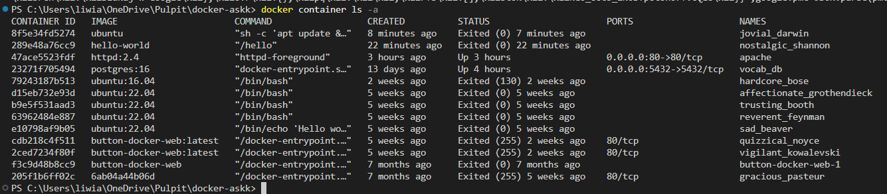
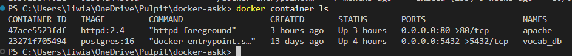
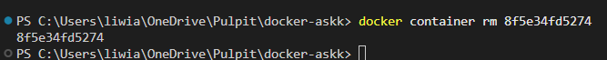
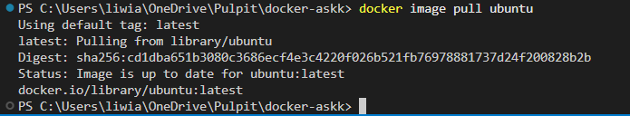
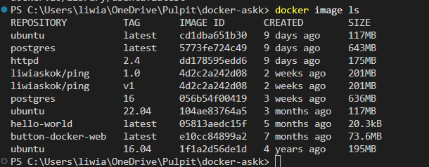
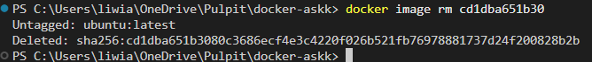

# Sekcja 1

### Uruchamianie kontenerów

> `docker container run hello-world`

> `docker container run -it ubuntu sh -c 'apt update && apt install -y curl && curl https://www.google.com'`

> `docker container ls -a`

> `docker container ls`

> `docker container rm 8f5e34fd5274 `

> `docker image pull ubuntu`

> `docker image ls`

> `docker image rm cd1dba651b30`

> ``

> ``

> ``

> ``

> ``

> ``

> ``

> ``

