# Seckja 2
## Uruchamianie i zatrzymywanie kontenerów

> `docker run ubuntu`

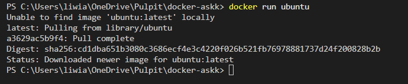

> `docker run -t ubuntu`

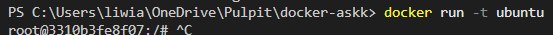

> `docker run -it ubuntu`

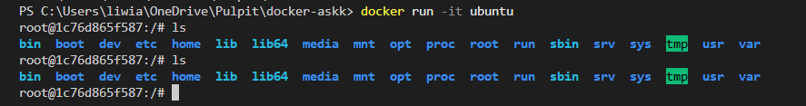

> `docker run -d -it --name looper ubuntu sh -c 'while true; do date; sleep 1; done'`

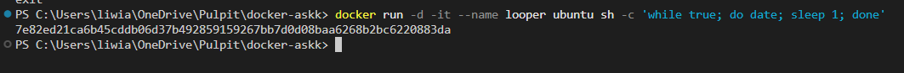

> `docker logs -f looper`

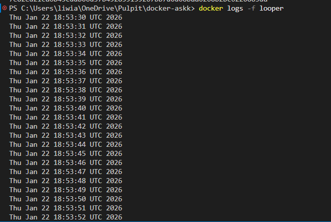

> `docker pause looper`

> `docker unpause looper`

> `docker attach looper`

### Uruchamianie procesów w kontenerze za pomocą docker exec

> `docker exec looper ls -la`

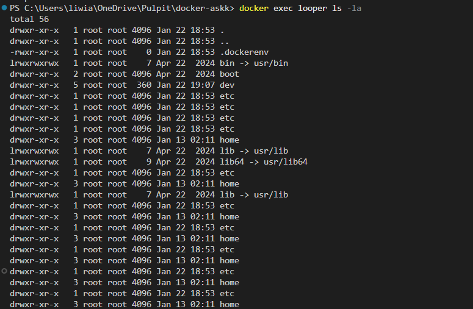

> `docker exec -it looper bash`

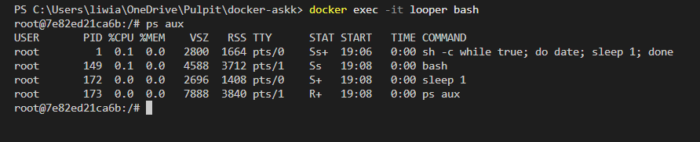

> `docker kill looper`

> `docker rm looper`

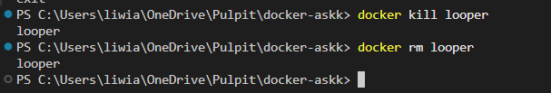

### Ćwiczenie 1.3

> `docker run -d --name task devopsdockeruh/simple-web-service:ubuntu`

> `docker start task`

> `docker ps`

> `docker exec -it task bash`

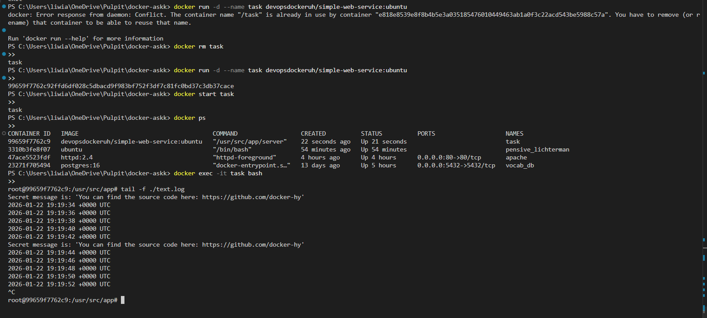

> `docker exec -it task bash`

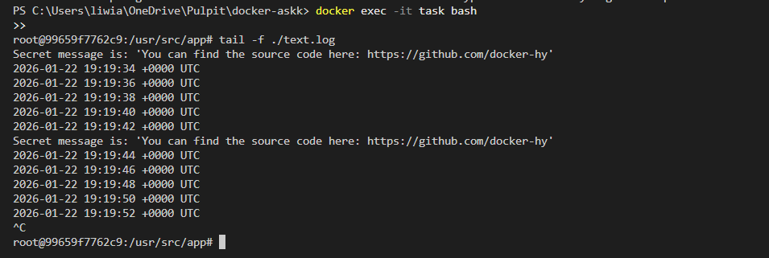

### Ubuntu w kontenerze to po prostu... Ubuntu

> `docker run -it ubuntu`

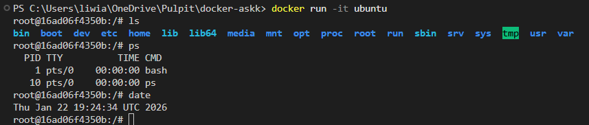

> `apt-get update`

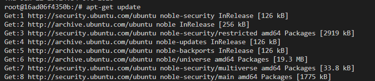

> `apt-get -y install nano`

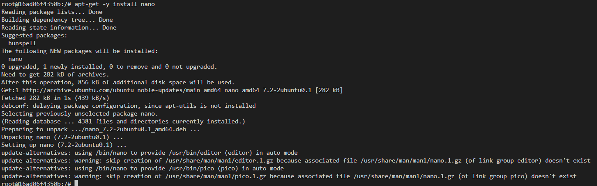

> `cd tmp/`

> `nano temp_file.txt`

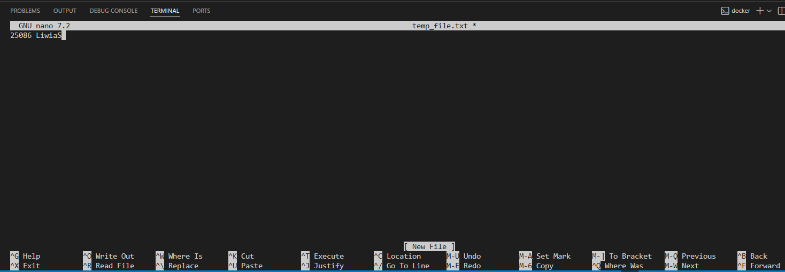

### Ćwiczenie 1.4

> `docker run -it --name ex14 ubuntu sh -c "while true; do echo 'Input website:'; read website; echo 'Searching..'; sleep 1; curl http://$website; done"`

> `helsinki.fi`

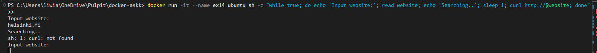

> `docker exec -it ex14 bash`

> `apt-get update`

> `apt-get -y install curl`

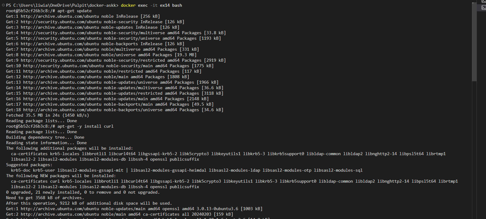

> `sh -c 'while true; do echo "Input website:"; read website; echo "Searching.."; sleep 1; curl http://$website; done'`

> `helsinki.fi`

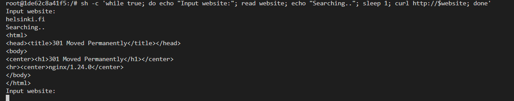