# Sekcja 3
## Skąd biorą się obrazy?

> `docker search hello-world`

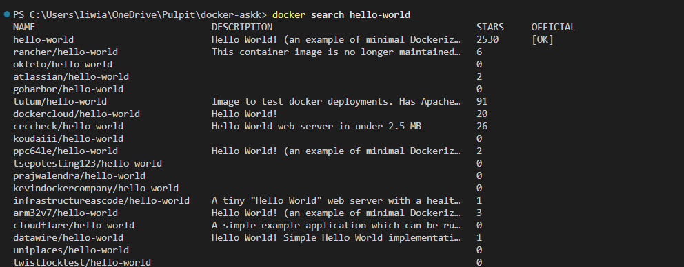

> `docker pull ubuntu`

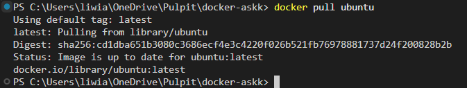

> `docker pull ubuntu:22.04`

> `docker tag ubuntu:22.04 fav_distro:jammy_jellyfish`

> `docker image ls`

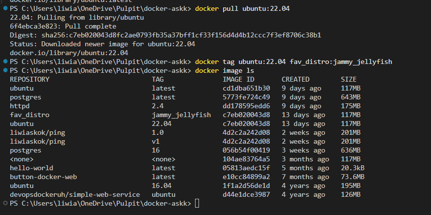

### Ćwiczenie 1.5

> `docker pull devopsdockeruh/simple-web-service:alpine `

> `docker run -it devopsdockeruh/simple-web-service:alpine`

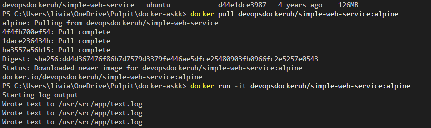

> `docker images devopsdockeruh/simple-web-service`

> `docker rm -f task-alpine 2>$null`

> `docker run -d --name task-alpine devopsdockeruh/simple-web-service:alpine`

> `docker exec -it task-alpine sh`

> `tail -f ./text.log`

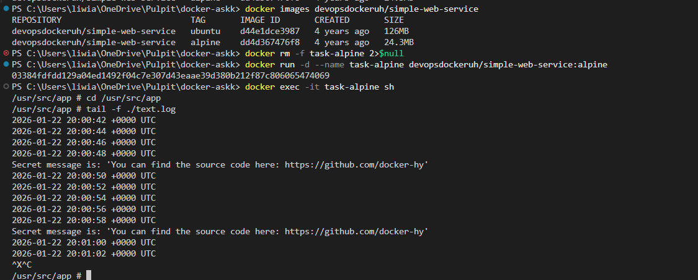

> `docker run -it devopsdockeruh/pull_exercise`

> `password: basics`

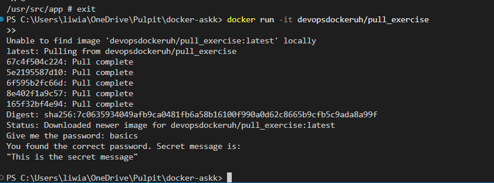

### Budowanie obrazów

[Skrypt](./hello.sh)

> `./hello.sh`

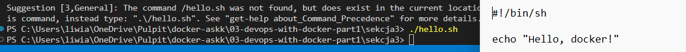

[Dockerfile](./Dockerfile)

> `docker build . -t hello-docker`

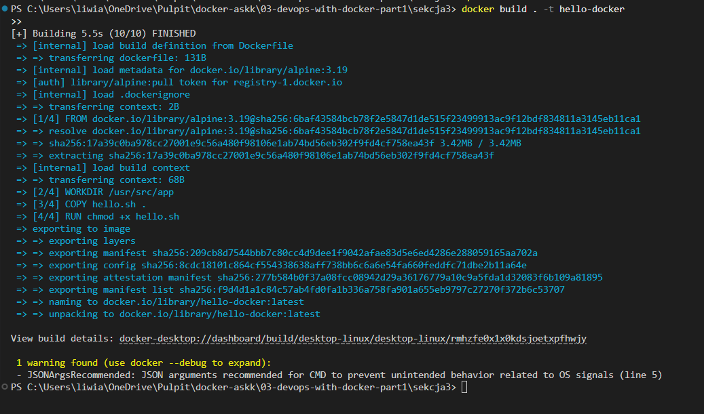

> `docker image ls`

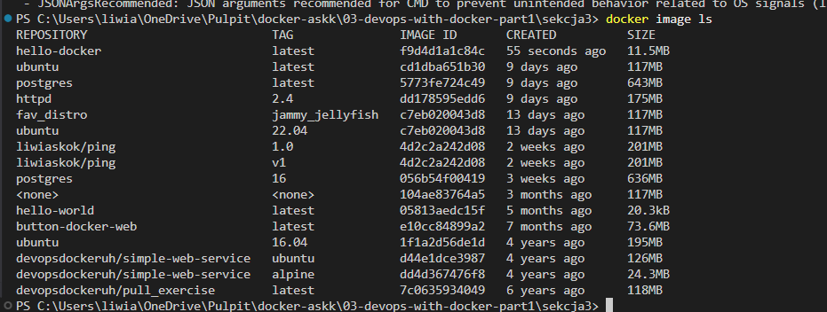

> `docker run hello-docker`

> `docker run -it hello-docker sh`

> `ls`

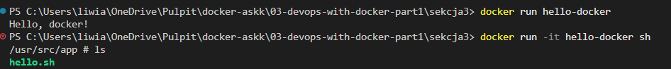

> `New-Item -ItemType File -Name additional.txt`

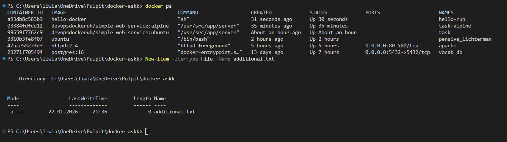

> `docker cp .\additional.txt hello-run:/usr/src/app/`

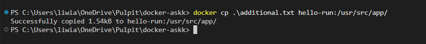

> `docker run -it --name hello-run hello-docker sh`

> ` ls -la` 

* Zmiana przed i po*

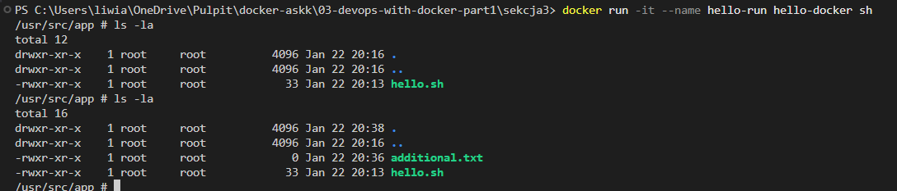

> `docker diff hello-run`

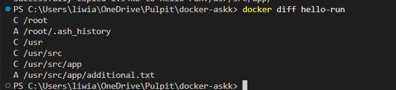

> `docker commit hello-run hello-docker-additional`

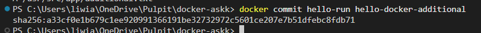

> `docker image ls`

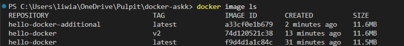

> `docker build . -t hello-docker:v2`

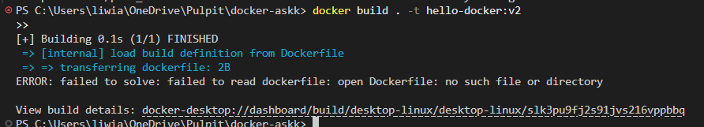

> `docker run --rm hello-docker-additional ls`

> `docker run --rm hello-docker:v2 ls`

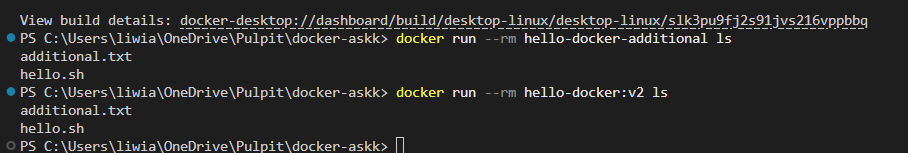

### Ćwiczenie 1.7

[Dockerfile](Dockerfile.cw)

> `docker build -f ./Dockerfile.cw -t curler .`

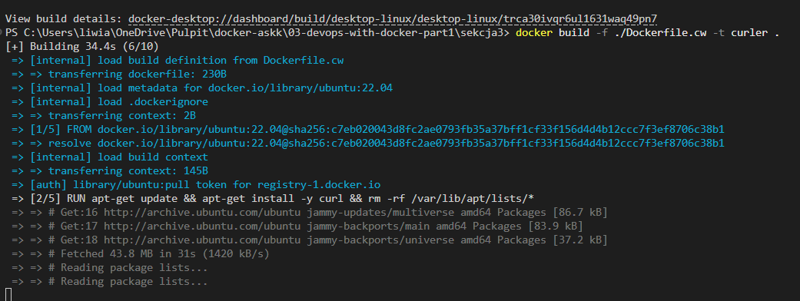

> `docker run -it curler`

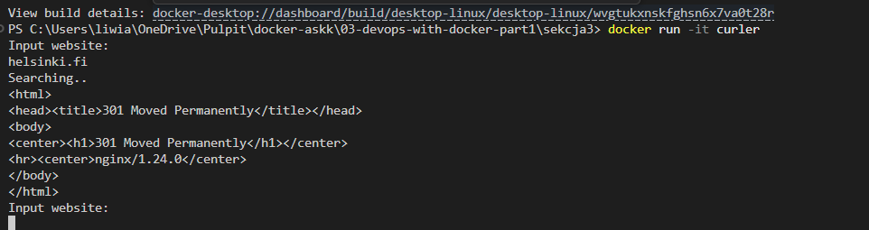

### Ćwiczenie 1.8

[Dockerfile](Dockerfile.cw2)

> `docker build -f ./Dockerfile.cw2 -t web-server .`

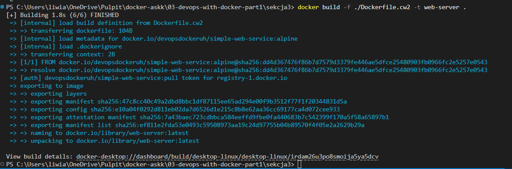

> `docker run web-server`

> ``

> ``

> ``

> ``

> ``

> ``

> ``

