# Sekcja 4
## Definiowanie warunków startowych kontenera

> ` docker run -it ubuntu:22.04`
> `curl -L https://github.com/yt-dlp/yt-dlp/releases/latest/download/yt-dlp -o /usr/local/bin/yt-dlp`

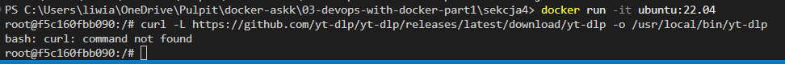

> `apt-get update && apt-get install -y curl`

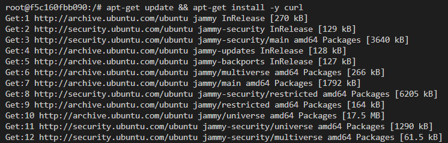

> `curl -L https://github.com/yt-dlp/yt-dlp/releases/latest/download/yt-dlp -o /usr/local/bin/yt-dlp`

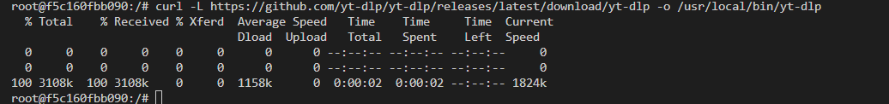

> `chmod a+rx /usr/local/bin/yt-dlp`

> `yt-dlp`

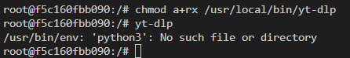

> `apt-get install -y python3`

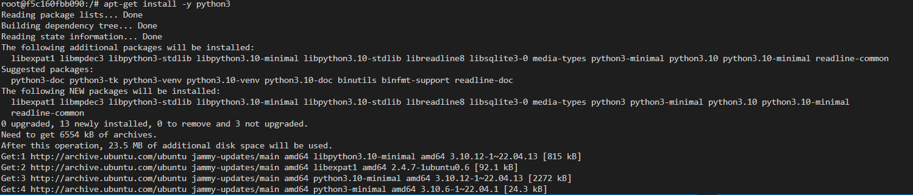

> `docker build -f Dockerfile.1 -t yt-dlp .`

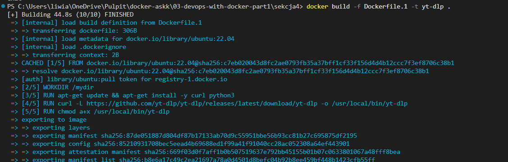

> `docker run --rm yt-dlp https://www.youtube.com/watch?v=XsqlHHTGQrw
`

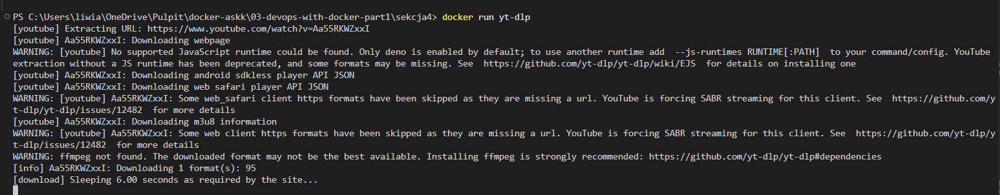

> `docker pull python:3.11`

> `docker run -it python:3.11`

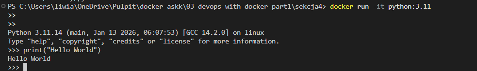

> `docker run -it python:3.11 --version`

> `docker run -it python:3.11 bash`

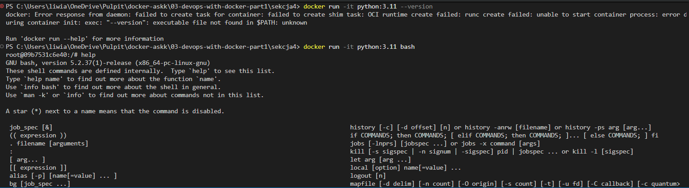

> `docker container ls -a`

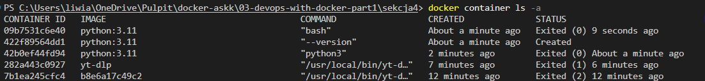

> `docker diff kind_bartik  `

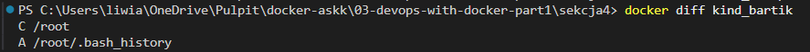

### Ulepszony curler

> `docker build . -t curler-v2`

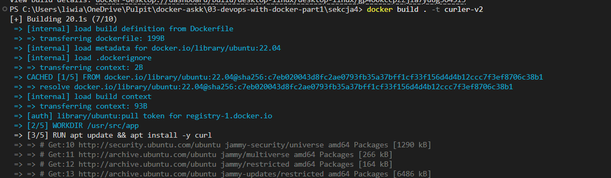

> `docker run curler-v2 helsinki.fi`

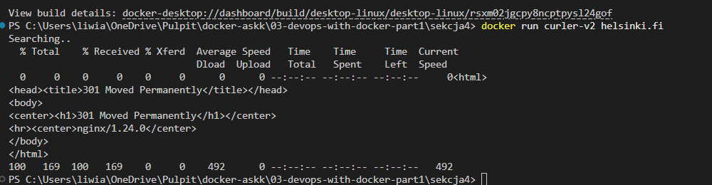

> ``

> ``

> ``

> ``

> ``

> ``

