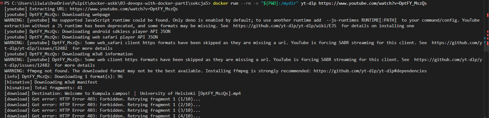
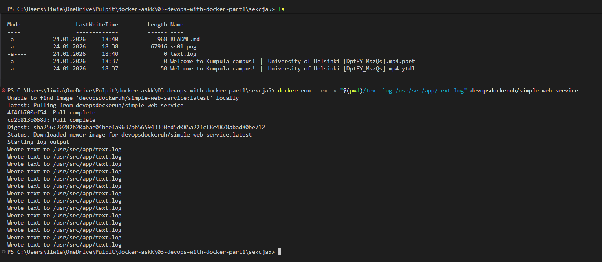
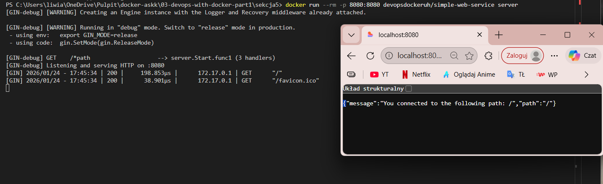

# Sekcja 5
## Interakcja z kontenerem przez wolumeny i porty

> `docker run -v "$(pwd):/mydir" yt-dlp https://www.youtube.com/watch?v=DptFY_MszQs`

### Ćwiczenie 1.9

> `new-item text.log`

> `docker run --rm -v "$(pwd)/text.log:/usr/src/app/text.log" devopsdockeruh/simple-web-service`

### Ćwiczenie 1.10

> `docker run --rm -p 8080:8080 devopsdockeruh/simple-web-service server`

