# Sekcja 6

## Wykorzystywanie narzędzi z rejestru

[Dockerfile.ruby][Dockerfile.ruby]

> `git clone https://github.com/docker-hy/material-applications.git`

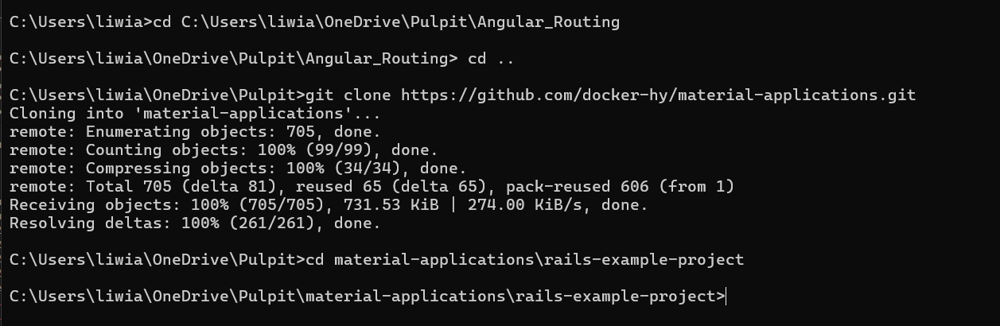

> `notepad Dockerfile`

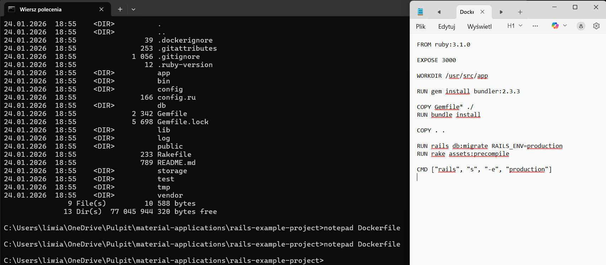

> `ren Dockerfile.txt Dockerfile`

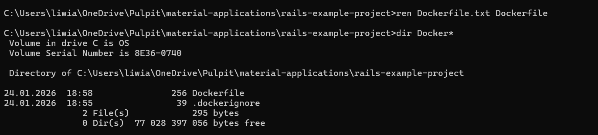

> `docker build -t rails-project .`

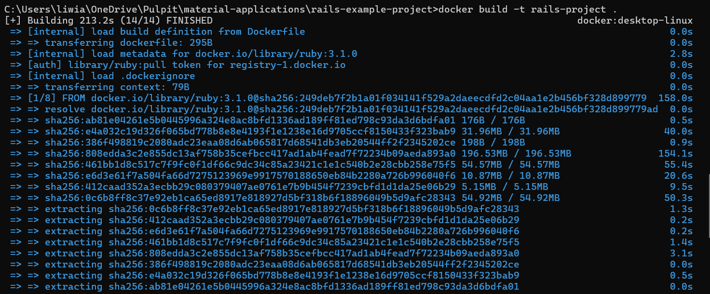

> `docker run --rm -p 3000:3000 rails-project`

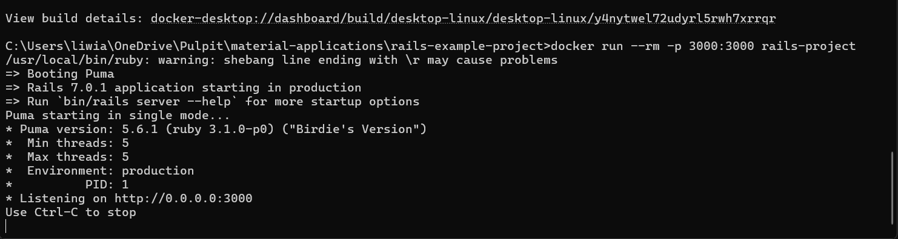

> `http://localhost:3000`

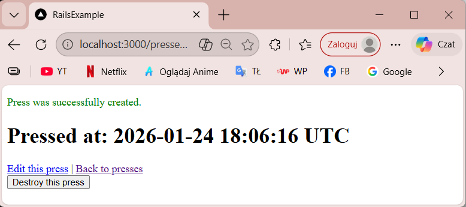

### 1.11 Spring

[Dockerfile.java][Dockerfile.java]

> `docker build -t spring-project .`

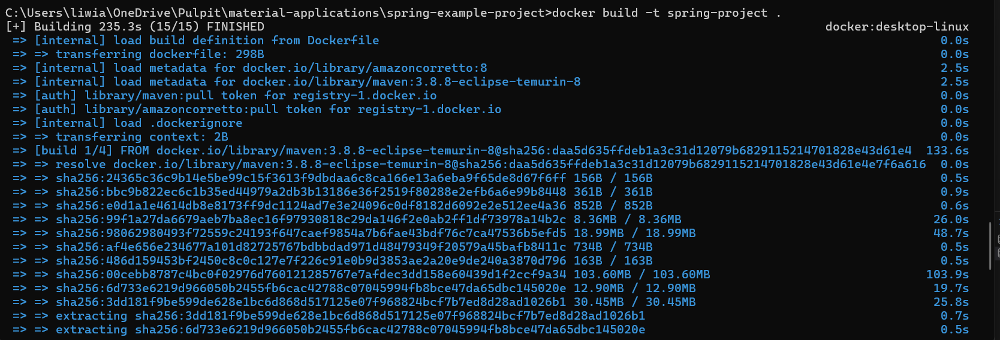

> `docker run --rm -p 8080:8080 spring-project`

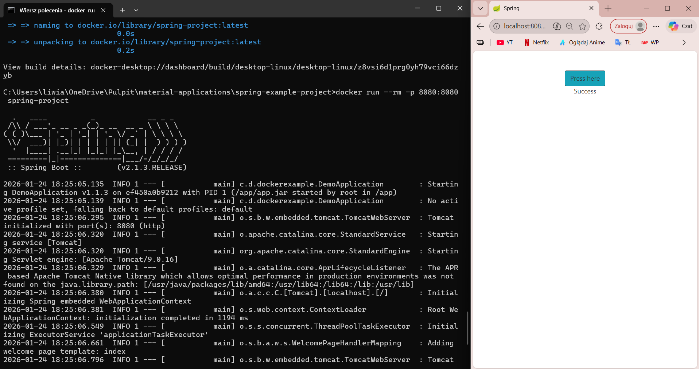

### 1.12 Hello, frontend

[Dockerfile.frontend][Dockerfile.frontend]

> `docker build -t example-frontend .`

> `docker run --rm -p 5000:5000 example-frontend`

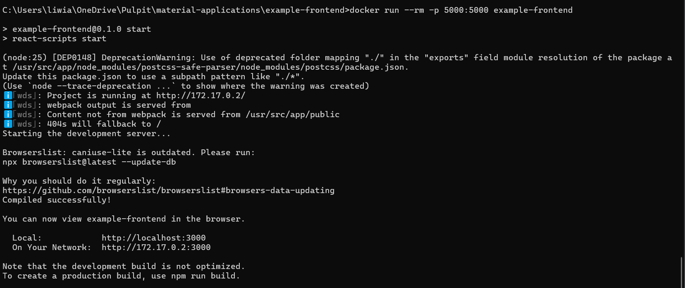

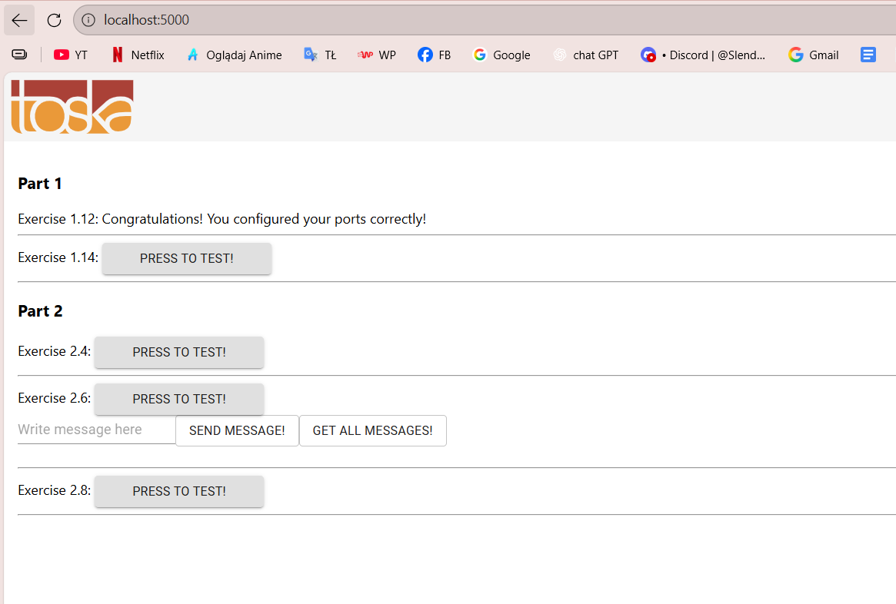

### 1.13 Hello, backend

[Dockerfile.backend][Dockerfile.backend]

> `docker build -t example-backend .`

> `docker run --rm -p 8080:8080 example-backend`

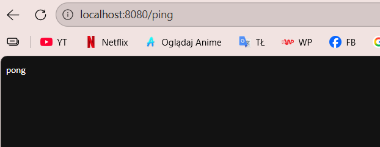

### 1.14 Environment (front + back + ENV)

> `docker run --rm -p 5000:5000 example-frontend`

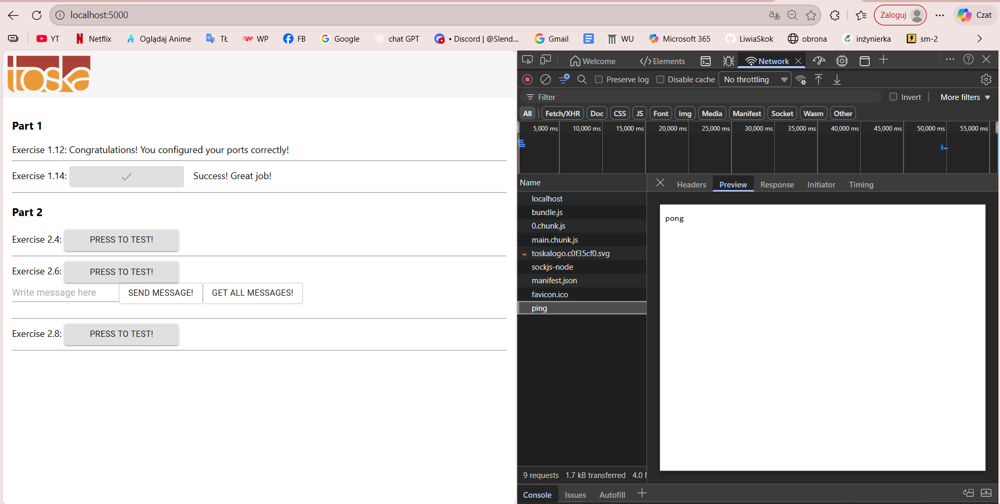

### Publikowanie projektów

[Link do repozytorium](https://hub.docker.com/repository/docker/liwiaskok/yt-dlp/general)

> `docker login`
> `docker tag yt-dlp liwiaskok/yt-dlp:latest`
> `docker push liwiaskok/yt-dlp:latest`

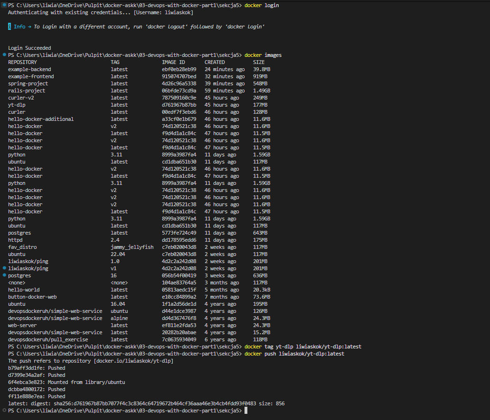

### 1.15

[Link do repozytorium](https://hub.docker.com/repository/docker/liwiaskok/yt-dlp/general)

### 1.16

[Link do zdeplyowanej aplikacji na renderze][https://zad1-16-docker-latest.onrender.com]

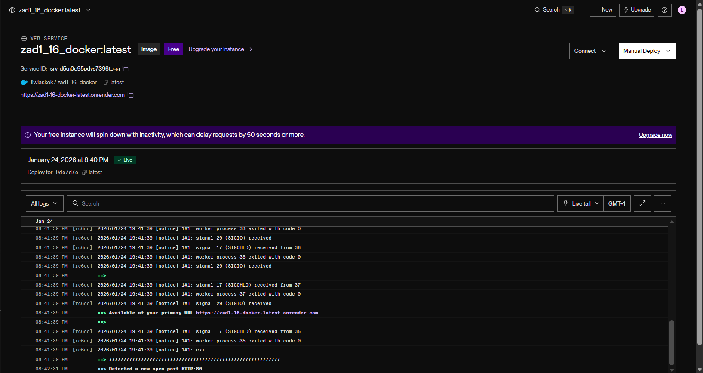

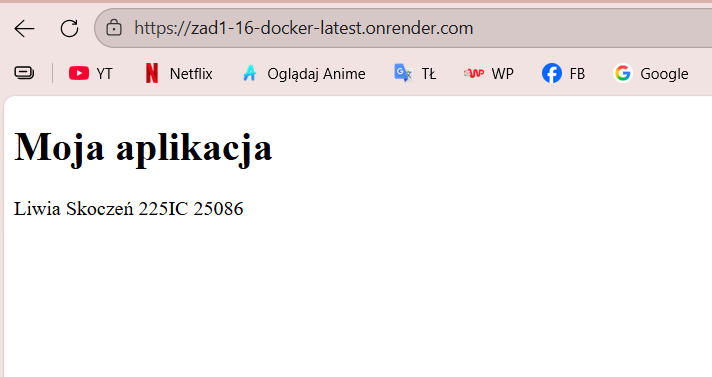