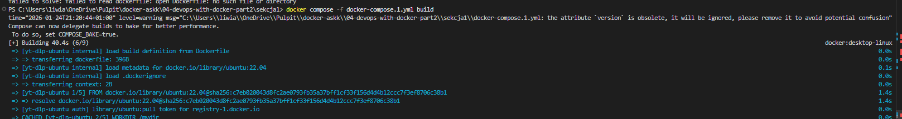
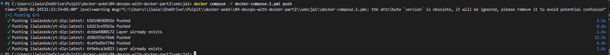
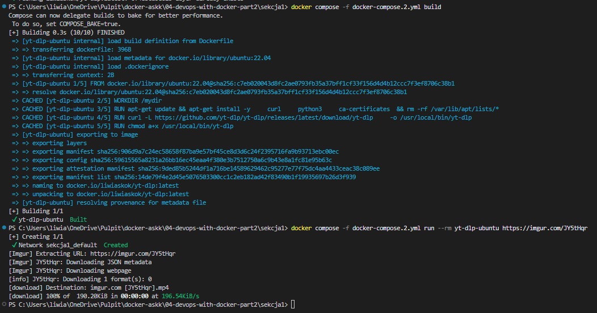
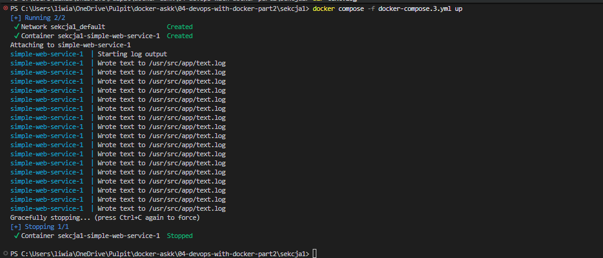
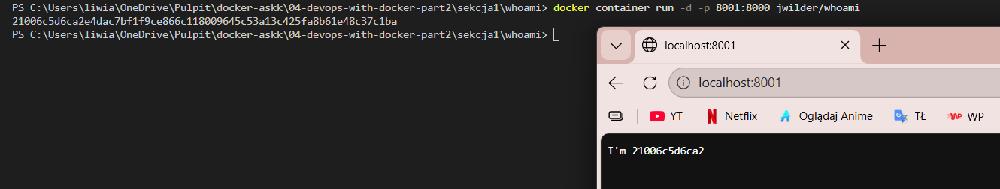
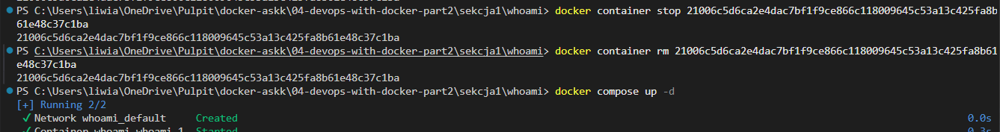
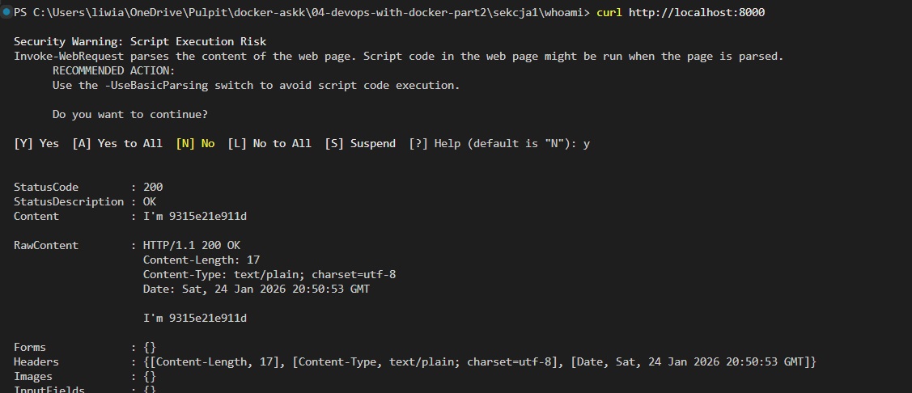
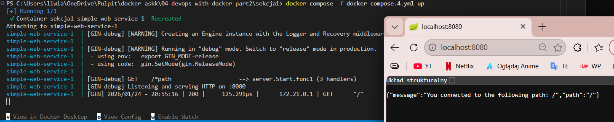
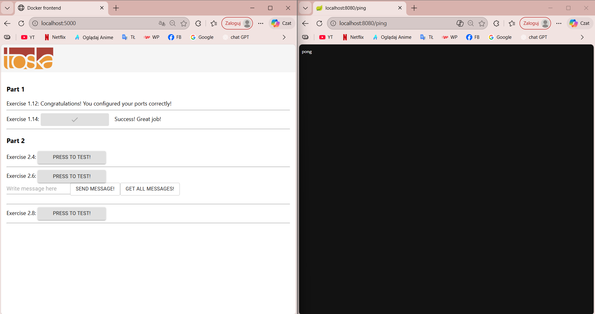

# Sekcja 1

## cdMigracja do Docker Compose

[Docker compose 1](docker-compose.1.yml)

> `docker compose -f docker-compose.1.yml build`

> `docker compose -f docker-compose.1.yml push`

### Wolumeny w Docker Compose

[Docker compose 2](docker-compose.2.yml)

> `docker compose -f docker-compose.2.yml build`

> `docker compose -f docker-compose.2.yml run --rm yt-dlp-ubuntu https://imgur.com/JY5tHqr`

### Ćwiczenie 2.1

[Docker compose 3](docker-compose.3.yml)
[text.log](text.log)

> `docker compose -f docker-compose.3.yml build`

> `docker compose -f docker-compose.3.yml up`

### Usługi webowe w Docker Compose

> `docker container run -d -p 8000:8000 jwilder/whoami`

> `docker container stop 21006c5d6ca2e4dac7bf1f9ce866c118009645c53a13c425fa8b61e48c37c1ba`

> `docker container rm 21006c5d6ca2e4dac7bf1f9ce866c118009645c53a13c425fa8b61e48c37c1ba`

> `docker compose up -d`

> `curl http://localhost:8000`

[Docker compose](./whoami/docker-compose.yml)

### Ćwiczenia 2.2

[Docker compose](docker-compose.4.yml)

> `docker compose -f docker-compose.4.yml up`

### Ćwiczenie 2.3

[Docker compose](./cw2.3/docker-compose.yml)

> `docker compose up --build`

> `http://localhost:5000`

> `http://localhost:8080/ping`

