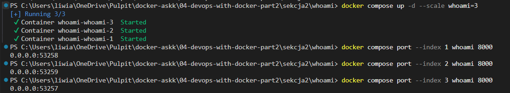
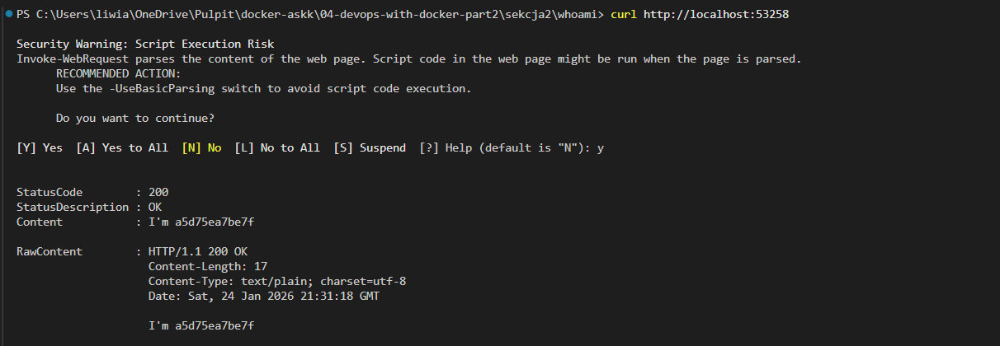
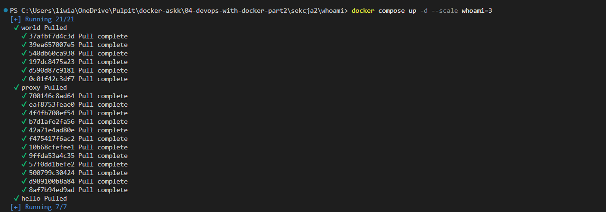
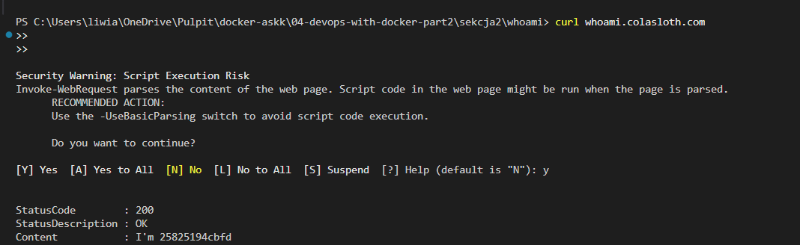
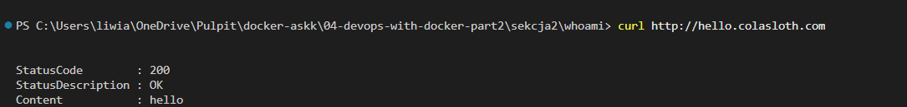
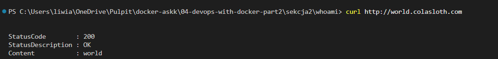
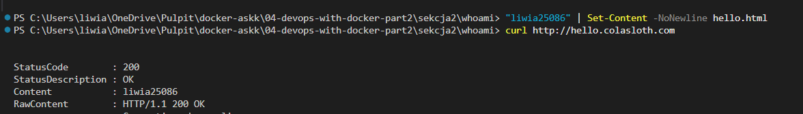
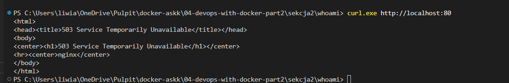
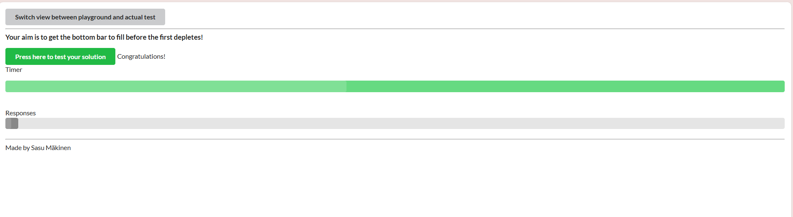

# Sekcja 2
## Sieci Dockera

### Ćwiczenie 2.4

> `docker compose up --build`

[docker compose](./cw2_4/docker-compose.yml)

### Skalowanie

> `docker compose up -d --scale whoami=3`

> `docker compose port --index 1 whoami 8000`

> `docker compose port --index 2 whoami 8000`

> `docker compose port --index 3 whoami 8000`

> `curl http://localhost:53258`

> `docker compose up -d --scale whoami=3`

> `docker compose ps`

> `curl whoami.colasloth.com`

> `curl http://hello.colasloth.com`

> `curl http://world.colasloth.com`

> `"liwia25086" | Set-Content -NoNewline hello.html`

> `curl http://hello.colasloth.com`

> `curl.exe http://localhost:80`

### Ćwiczenie 2.5

> `docker compose up -d`

> `docker compose up -d --scale compute=3`

