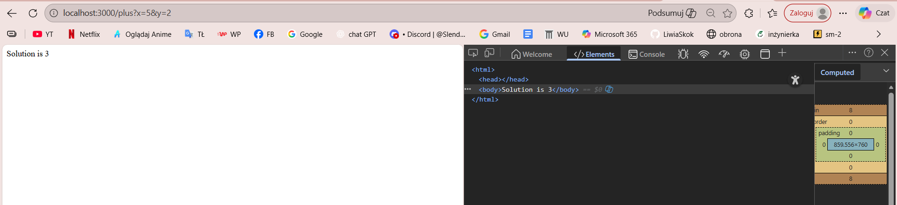
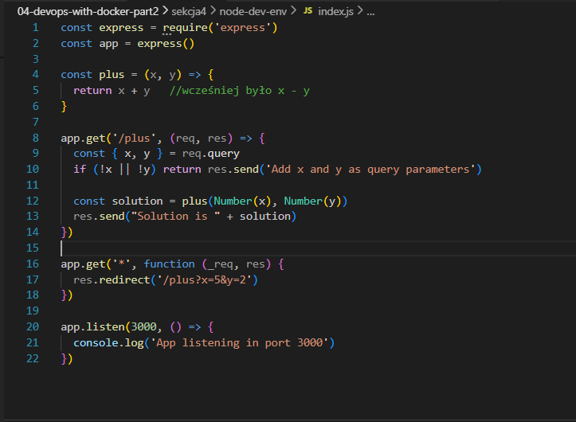
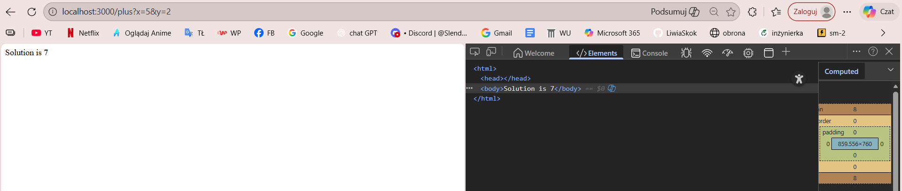
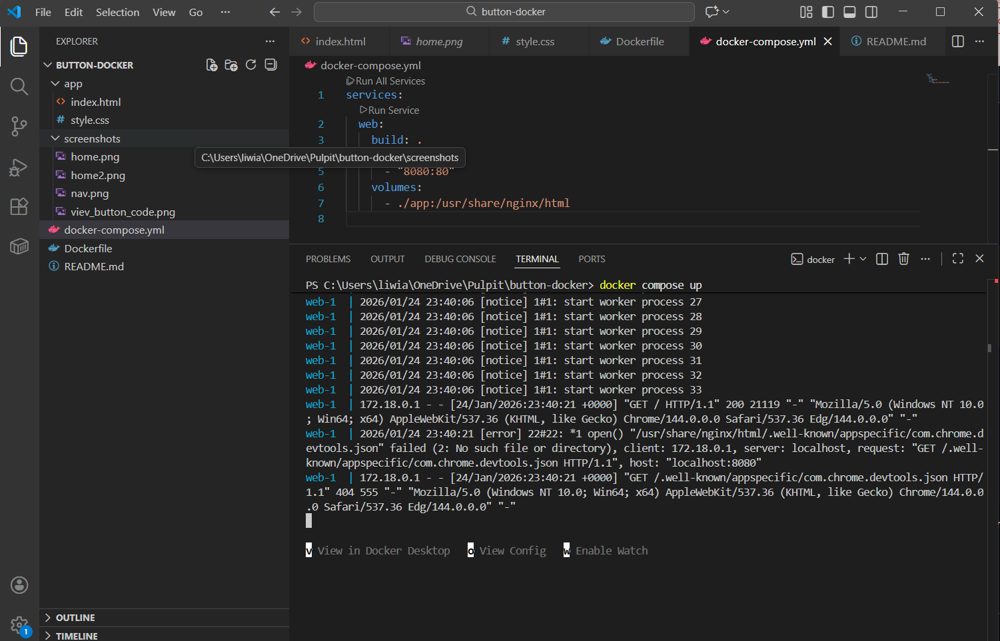
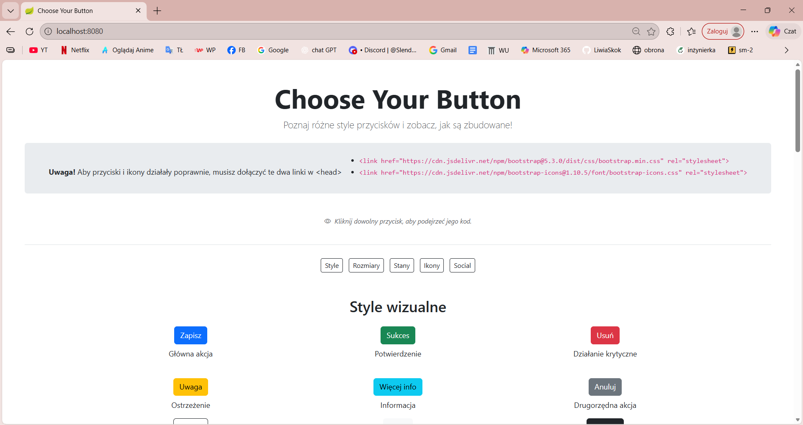

# Sekcja 4

## Kontenery w środowisku deweloperskim

> `docker compose up`



*Poprawiono błąd w funkcji plus, która zamiast dodawania wykonywała odejmowanie. Po zmianie aplikacja zwraca poprawny wynik.*



*Poprawny wynik po zmianie*



### Ćwiczenie 2.11

## Środowisko deweloperskie (Docker)

Projekt wykorzystuje Docker oraz docker-compose do uruchamiania środowiska deweloperskiego.

W ramach zadania dodano:
- `Dockerfile` z serwerem NGINX,
- `docker-compose.yml`, który uruchamia serwis webowy w kontenerze.

Aplikacja jest statyczną stroną (HTML + CSS) serwowaną przez NGINX.  
Pliki źródłowe są montowane do kontenera za pomocą wolumenu, dzięki czemu zmiany w kodzie są widoczne od razu po odświeżeniu przeglądarki, bez potrzeby przebudowy obrazu.

Takie rozwiązanie eliminuje konieczność instalowania lokalnego serwera do uruchamiania strony i pozwala startować projekt jednym poleceniem.

### Uruchomienie projektu

```bash
docker compose up

http://localhost:8080

```




