# Sekcja 2
### Własny pipeline


### Ćwiczenie 3.1

> `npm start`

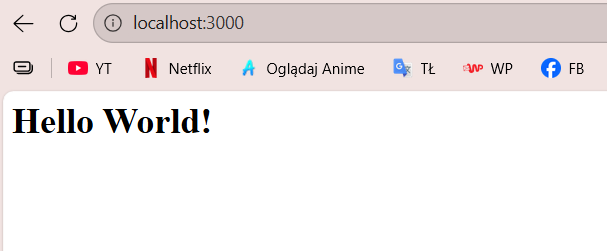

> `docker build -t express-app .`

> `docker run -d --name express -p 8080:3000 express-app`

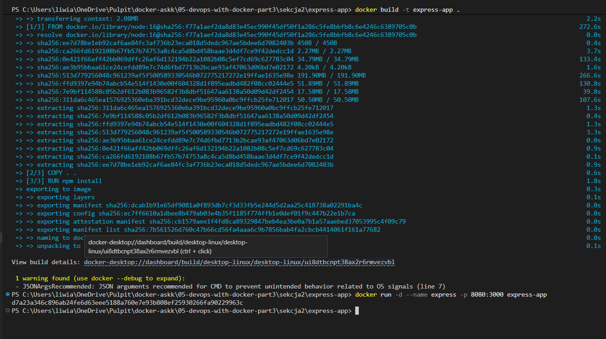

> `docker logs -f express`

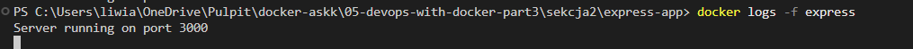

> `DOCKERHUB_USERNAME = Twój login`

> `DOCKERHUB_TOKEN = token z Docker Hub`

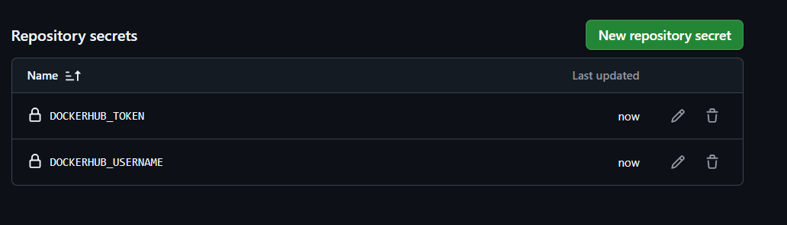

[release.yml](../../.github/workflows/release.yml)

[Dockerhub link](https://hub.docker.com/repository/docker/liwiaskok/express-app/general)

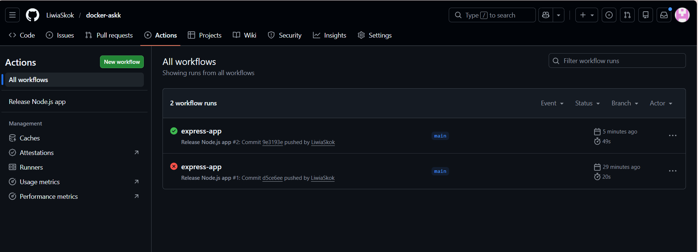

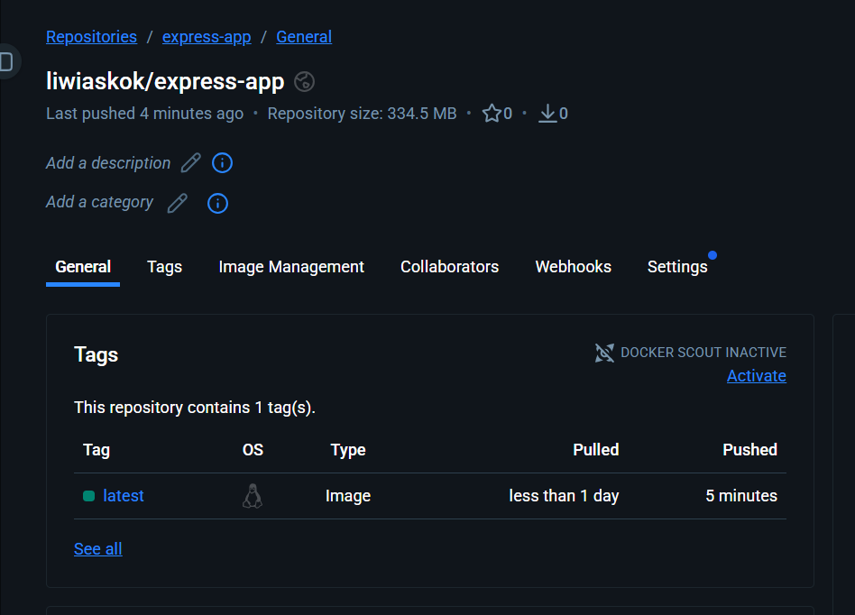

> `docker run -d --name express -p 3000:3000 liwiaskok/express-app:latest`

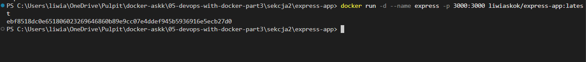

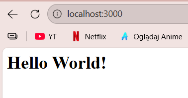


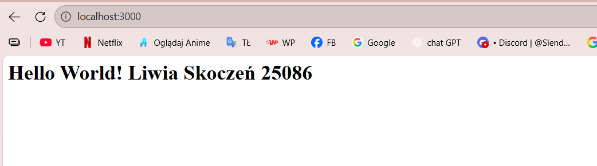

### Ćwiczenie 3.2

[deploy-render.yml](.github\workflows\deploy-render.yml)

*Skonfigurowano Deploy Hook w Render do automatycznego wdrażania aplikacji.*

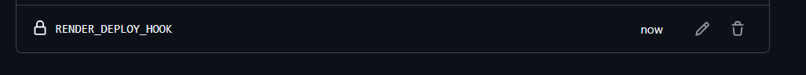

*Lista wykonanych deployów aplikacji w Render, wyzwalanych automatycznie przez pipeline GitHub Actions*

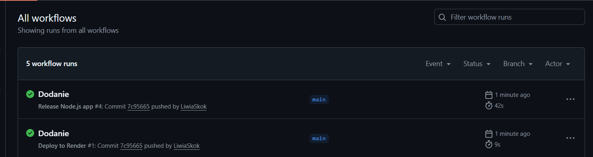

*Widok uruchomionego deployu aplikacji w Render.*

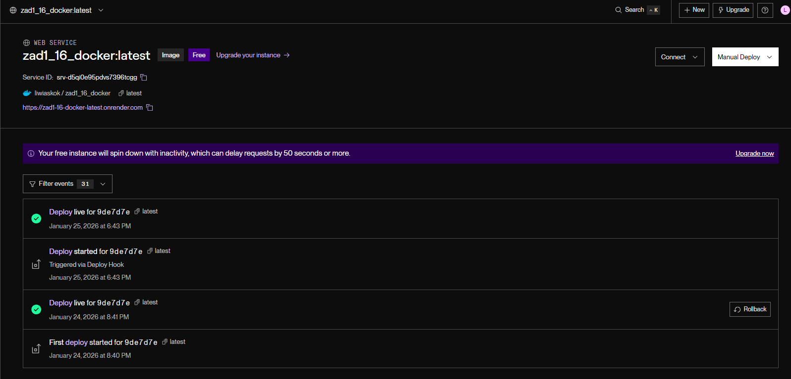

[Aplikacja](https://zad1-16-docker-latest.onrender.com/)

*Po wprowadzeniu zmian w kodzie i wykonaniu push, aplikacja została automatycznie przebudowana i ponownie wdrożona na Render.*

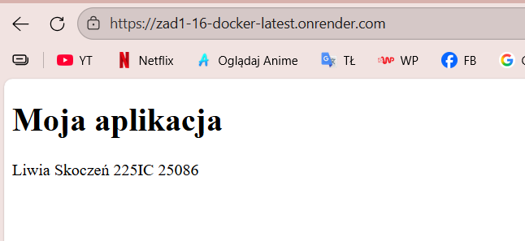

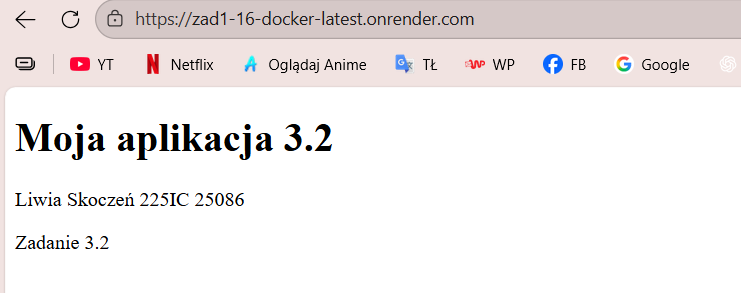

### Ćwiczenie 3.3

[Skrypt builder.sh](05-devops-with-docker-part3\sekcja2\builder.sh)

> `wsl --install -d Ubuntu`

> `chmod +x builder.sh`

> `docker login`

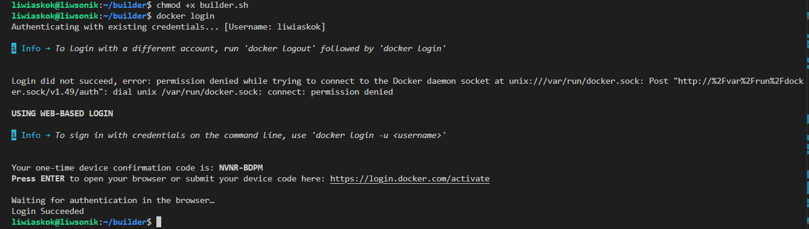

> `./builder.sh mluukkai/express_app liwiaskok/testing`

> `cd ~/builder`

> `DOCKER_USER=liwiaskok DOCKER_PWD=MÓJ_TOKEN ./builder.sh mluukkai/express_app liwiaskok/testing`

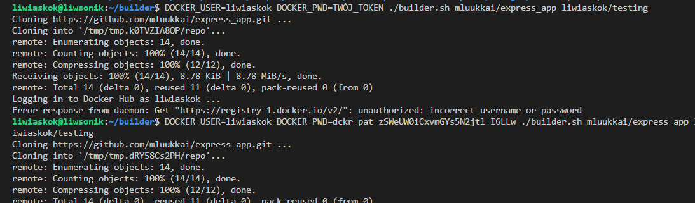

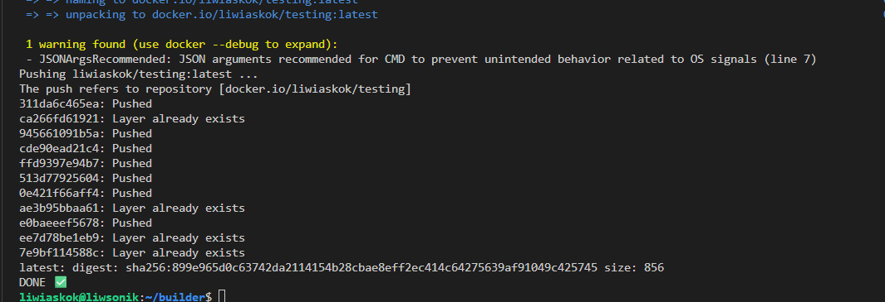

### Ćwiczenie 3.4

[Repozytorium Dockerhub](https://hub.docker.com/repository/docker/liwiaskok/testing/general)

> `nano Dockerfile`

> `ls`

> `docker build -t builder .`

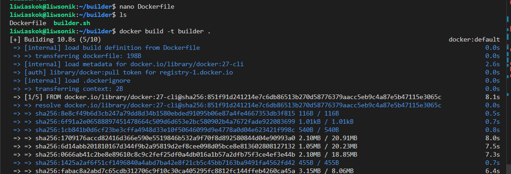

``` bash
docker run --rm \
  -e DOCKER_USER=liwiaskok \
  -e DOCKER_PWD=mój_token \
  -v /var/run/docker.sock:/var/run/docker.sock \
  builder mluukkai/express_app liwiaskok/testing
```

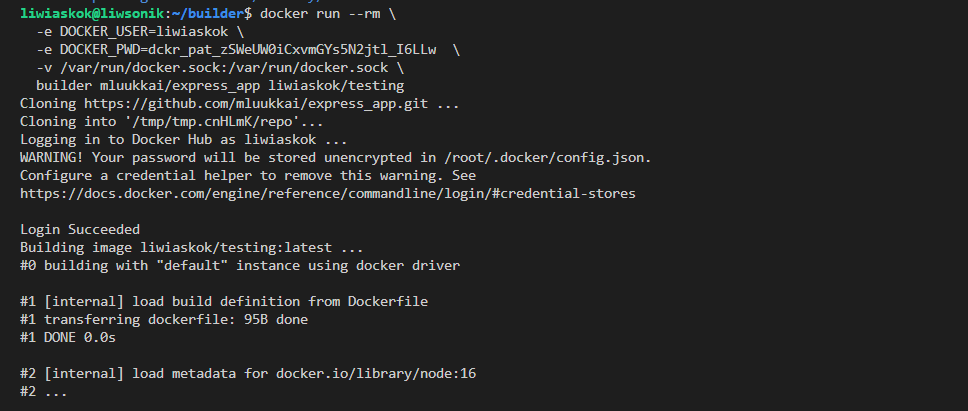

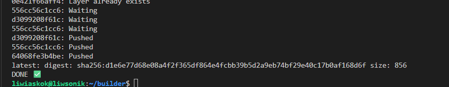